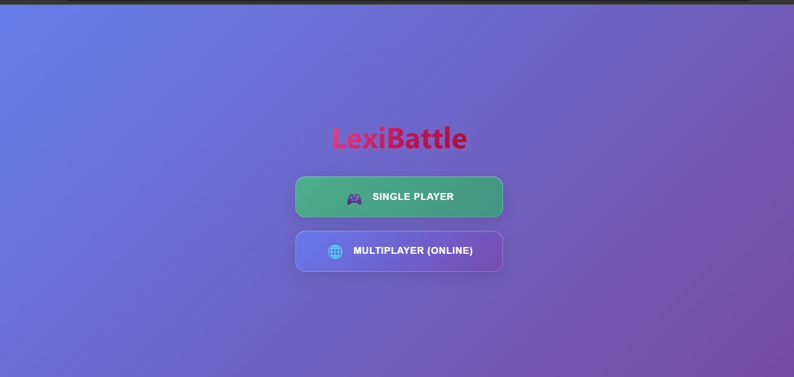
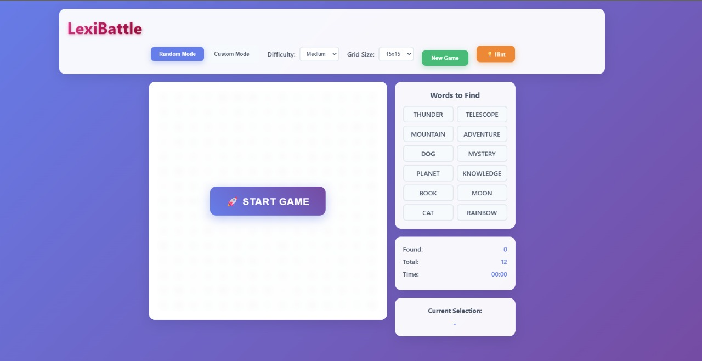
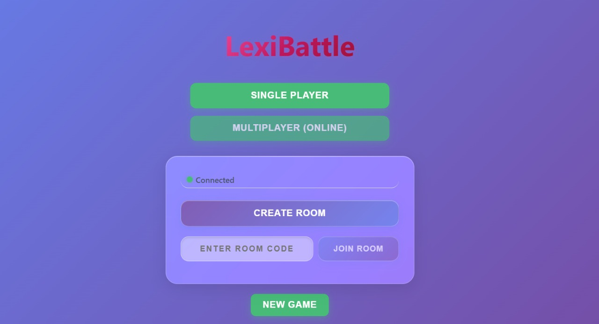
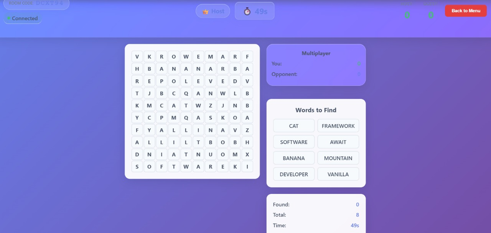
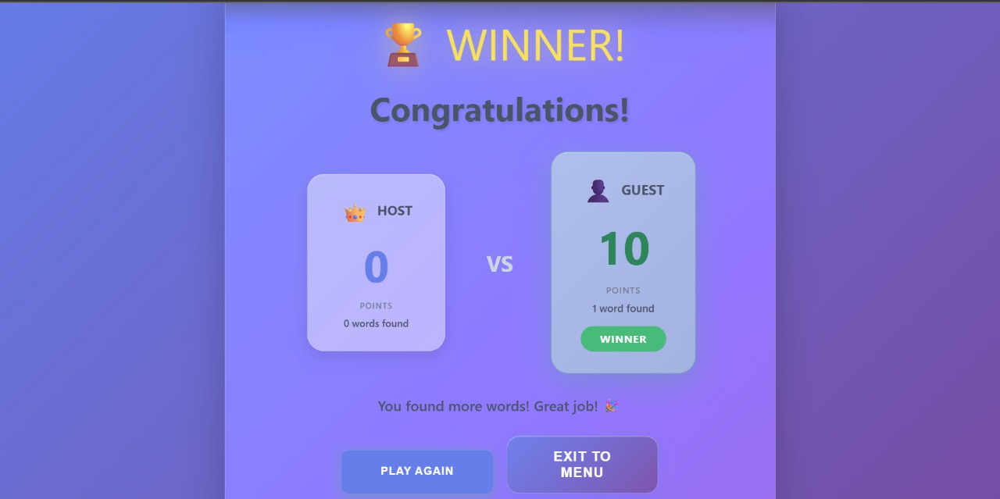
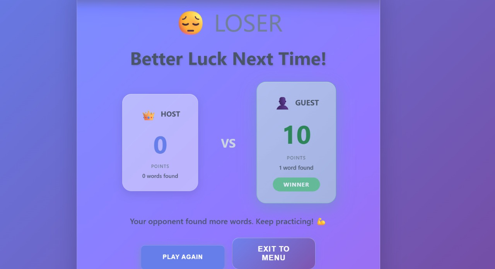
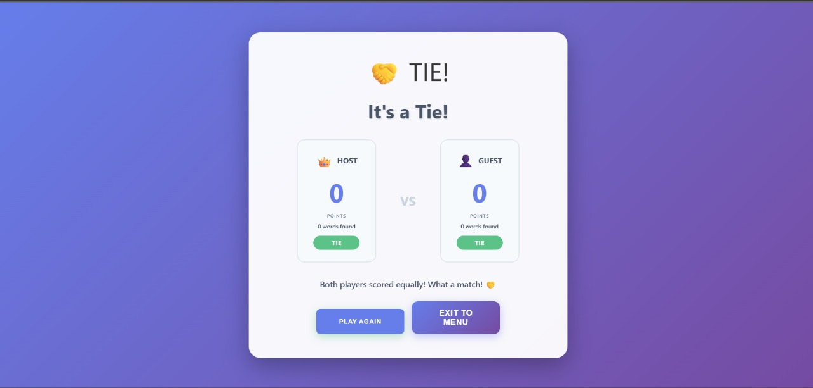

# LexiBattle ⚔️🎮

<div align="center">

**A fast-paced multiplayer word search battle game!**

Compete against friends in real-time word-finding competitions. Find words faster, score more points, and claim victory!

[](https://reactjs.org/)
[](https://socket.io/)
[](https://nodejs.org/)

</div>

---

## 📑 Table of Contents

- [✨ Features](#-features)
- [🚀 Quick Start Guide](#-quick-start-guide)
- [🎯 How to Play](#-how-to-play)
- [📸 Screenshots](#-screenshots)
- [📁 Project Structure](#-project-structure)
- [🛠️ Tech Stack](#️-tech-stack)
- [🔌 WebSocket API](#-websocket-api)
- [🔧 Troubleshooting](#-troubleshooting)
- [🚀 Deployment Guide](#-deployment-guide)

---

## 📸 Screenshots

### Main Menu

*Main menu with Single Player and Multiplayer options*

### Single Player Gameplay

*Game board with word search grid and sidebar*

### Multiplayer Room

*Room creation/joining interface*

### Battle in Progress

*Multiplayer game with timer, scores, and shared board*

### Winner Screen

*Victory screen with final scores and winner announcement*

### Loser Screen

*Defeat screen showing opponent's victory*

### Tie Screen

*Tie screen when both players score equally*

## ✨ Features

### 🎯 Game Modes

#### Single Player Mode
- **Random Mode**: Play with automatically generated word lists
- **Custom Mode**: Create and save your own word lists
- Multiple difficulty levels (Easy, Medium, Hard)
- Flexible grid sizes (10×10 to 20×20)

#### Multiplayer Battle Mode ⚔️
- **Real-time Competition**: Battle against friends in live matches
- **Shared Puzzle**: Both players compete on the **same board** with identical words
- **60-Second Rounds**: Fast-paced timed challenges
- **Chain Rounds**: Complete all words to unlock new rounds without timer reset
- **Live Scoring**: See your opponent's progress in real-time
- **Room System**: Easy room creation and joining with 6-character codes

### 🎮 Gameplay Features

- **Drag & Select**: Intuitively select words by clicking and dragging
- **8-Direction Search**: Words can be found horizontally, vertically, and diagonally (both directions)
- **Visual Feedback**: Found words are highlighted with colors
- **Hint System**: Get help finding words (with cooldown timer)
- **Timer Tracking**: See your completion time in single-player mode
- **Win Celebrations**: Animated victory screens

### 💾 Data Persistence
- Custom word lists saved automatically
- Your preferences persist between sessions

## 🚀 Quick Start Guide

### 📋 Prerequisites

Before you begin, make sure you have:
- **Node.js** version 16 or higher ([Download here](https://nodejs.org/))
- **npm** (comes with Node.js) or **yarn**

### 📦 Installation

1. **Download or clone** this repository
2. **Open a terminal** in the project folder
3. **Install dependencies**:
   ```bash
   npm install
   ```
   This will install all required packages (React, Socket.IO, etc.)

### 🎮 Running the Game

#### Single Player Mode

Perfect for solo practice! Just run:

```bash
npm run dev
```

Then open your browser to: **http://localhost:5173**

That's it! You're ready to play! 🎉

---

#### Multiplayer Mode ⚔️

For multiplayer battles, you need **two terminal windows**:

**📡 Terminal 1 - Start the Game Server:**
```bash
npm run server
```

You should see:
```
✅ Server running on port 4000
✅ WebSocket server ready at ws://localhost:4000
```

⚠️ **Keep this terminal open!** The server must stay running.

**🌐 Terminal 2 - Start the Game Client:**
```bash
npm run dev
```

You should see:
```
✅ VITE v5.x.x  ready in XXXX ms
➜  Local:   http://localhost:5173/
```

Then open **http://localhost:5173** in your browser.

> 💡 **Tip:** Both players need to run `npm run dev` in separate terminals/browsers, but only one needs to run the server!

## 🎯 How to Play

### 🎮 Single Player Mode

Perfect for practice and solo challenges!

1. **Start the game** - Run `npm run dev` and open http://localhost:5173
2. **Choose your mode**:
   - **Random Mode**: Play with auto-generated words
   - **Custom Mode**: Create your own word list
3. **Configure your game**:
   - Select grid size (10×10 to 20×20)
   - Choose difficulty (Easy/Medium/Hard) for Random Mode
4. **Start playing**:
   - Click **"New Game"** to generate the puzzle
   - Click **"Start Game"** to begin
   - **Drag across letters** to select words
   - Words can be found in **any direction** (horizontal, vertical, diagonal)
   - Use the **💡 Hint** button if you get stuck (5-second cooldown)
5. **Win!** Find all words to complete the puzzle

---

### ⚔️ Multiplayer Battle Mode

Compete against friends in real-time battles!

#### Setup (One-time per session)

1. **Start the server** (Terminal 1):
   ```bash
   npm run server
   ```

2. **Start the game** (Terminal 2):
   ```bash
   npm run dev
   ```

3. **Open the game** in your browser: http://localhost:5173

#### Creating a Battle Room (Host)

1. Click **"Multiplayer (Online)"** from the main menu
2. Wait for **"Connected"** status (green dot) ✅
3. Click **"Create Room"** button
4. **Copy the room code** (e.g., "ABC123") that appears
5. **Share the code** with your opponent
6. Wait for them to join - the game starts automatically!

#### Joining a Battle Room (Guest)

1. Click **"Multiplayer (Online)"** from the main menu
2. Wait for **"Connected"** status (green dot) ✅
3. **Enter the room code** (6 characters, case-sensitive)
4. Click **"Join Room"** button
5. Game starts automatically when both players are ready!

#### During Battle

- **Same Puzzle**: Both players see the **exact same board** and words
- **60-Second Timer**: Race against time to find words
- **10 Points Per Word**: Each word found = 10 points
- **Chain Rounds**: Find all 8 words before time ends to unlock a new round
- **Live Scores**: See your opponent's progress in real-time
- **Winner**: Highest score when timer hits 0 wins!

#### Custom Mode (Single Player)

Create your own challenges:

1. Select **"Custom Mode"**
2. **Add words** using the input field
   - Words must be 3-15 letters
   - Only letters A-Z allowed
3. **Remove words** by clicking them in the list
4. Choose your **grid size**
5. Click **"New Game"** to generate your custom puzzle

## 📁 Project Structure

```
LexiBattle/
├── 📄 index.html              # Main HTML template
├── 📦 package.json            # Project dependencies
├── ⚙️ vite.config.js          # Vite build configuration
│
├── 🖥️ server/
│   └── index.js               # WebSocket server (Socket.IO)
│
└── 💻 src/
    ├── 🎨 components/         # React UI components
    │   ├── MainMenu.jsx       # Main menu screen
    │   ├── MultiplayerMenu.jsx # Multiplayer room menu
    │   ├── MultiplayerGame.jsx # Multiplayer game screen
    │   ├── GameBoard.jsx      # Game board container
    │   ├── Grid.jsx           # Grid component
    │   ├── Cell.jsx           # Individual cell
    │   ├── Sidebar.jsx        # Word list & stats
    │   ├── WinnerScreen.jsx   # Victory screen
    │   └── ...                # Other components
    │
    ├── 🪝 hooks/              # Custom React hooks
    │   ├── useGameLogic.js    # Single-player game logic
    │   ├── useMultiplayerGame.js # Multiplayer game logic
    │   └── useSocket.js       # WebSocket connection
    │
    ├── 📱 App.jsx             # Main app component
    ├── 🚀 main.jsx            # Application entry point
    └── 🎨 styles.css          # Global styles
```

## 🛠️ Tech Stack

### Frontend
- ⚛️ **React 18** - Modern UI framework
- ⚡ **Vite** - Lightning-fast build tool
- 🔌 **Socket.IO Client** - Real-time WebSocket communication

### Backend
- 🟢 **Node.js** - JavaScript runtime
- 🚀 **Express** - Web server framework
- 🔌 **Socket.IO** - Real-time WebSocket server
- 🌐 **CORS** - Cross-origin resource sharing

## 🔌 WebSocket API

### 📤 Client → Server Events
- `createRoom` - Create a new battle room
- `joinRoom` - Join an existing room
- `hostStartGame` - Host starts the game
- `wordFound` - Player found a word
- `roundComplete` - Request new round (chain-round)
- `leaveRoom` - Leave current room

### 📥 Server → Client Events
- `hostCreatedRoom` - Room created, code assigned
- `guestJoinedRoom` - Successfully joined room
- `opponentJoined` - Opponent connected
- `generateBoards` - Receive puzzle (words + grid)
- `hostStartGame` - Game starting signal
- `timerSync` - Timer updates (every second)
- `updateScores` - Score updates
- `nextBoard` - New round started (chain-round)
- `finalResults` - Game ended, winner announced
- `opponentLeft` - Opponent disconnected

## 🎨 Design Highlights

- ✨ **Modern UI** with beautiful gradient backgrounds
- 🪟 **Glassmorphism effects** for elegant panels
- 🎭 **Smooth animations** for engaging interactions
- 📱 **Fully responsive** - works on desktop, tablet, and mobile
- ♿ **Accessible design** with proper contrast and keyboard support
- 🎨 **Color-coded words** for easy visual tracking

## 📜 Available Commands

| Command | Description |
|---------|-------------|
| `npm run dev` | 🚀 Start development server (frontend) |
| `npm run server` | 📡 Start WebSocket server (backend) |
| `npm run build` | 📦 Build for production |
| `npm run preview` | 👀 Preview production build |

## 🌐 Browser Support

✅ **Fully supported:**
- Chrome 60+
- Firefox 60+
- Safari 12+
- Edge 79+
- Opera 47+

💡 **Best experience:** Use the latest version of your browser

## 🔧 Troubleshooting

### ❌ Common Issues & Solutions

#### Multiplayer Connection Problems

**Problem: "Create Room" button is disabled**
- ✅ Check that the server is running (`npm run server`)
- ✅ Look for "Connected" status (green dot) in the multiplayer menu
- ✅ Open browser console (F12) to check for errors
- ✅ Refresh the page (Ctrl+Shift+R or Cmd+Shift+R)

**Problem: Can't connect to server**
- ✅ Verify server is running on port 4000
- ✅ Check browser console for WebSocket errors
- ✅ Ensure firewall isn't blocking port 4000
- ✅ Try restarting both servers

**Problem: Room not found**
- ✅ Double-check the room code (6 characters, case-sensitive)
- ✅ Room codes expire if host disconnects
- ✅ Make sure you're entering the exact code

**Problem: Can't join room**
- ✅ Room might be full (max 2 players per room)
- ✅ Game might have already started
- ✅ Host might have disconnected

**Problem: Server won't start**
- ✅ Check if port 4000 is in use:
  ```bash
  # Windows
  netstat -ano | findstr :4000
  
  # Mac/Linux
  lsof -i :4000
  ```
- ✅ Kill the process or use a different port
- ✅ Verify Node.js is installed: `node --version`

#### Gameplay Issues

**Problem: Grid not displaying**
- ✅ Check that JavaScript is enabled in your browser
- ✅ Clear browser cache and refresh
- ✅ Check browser console for errors

**Problem: Words not being found**
- ✅ Make sure you're selecting in a **straight line**
- ✅ Words can be horizontal, vertical, or diagonal
- ✅ Try selecting from start to end (or end to start)

**Problem: Mobile selection issues**
- ✅ Use shorter, more precise drag gestures
- ✅ Try tapping individual cells if dragging doesn't work
- ✅ Ensure you're not accidentally scrolling the page

## 🚀 Deployment Guide

### Production Setup

1. **Update Socket URL**:
   - Edit `src/hooks/useSocket.js`
   - Change `SOCKET_URL` to your production server URL

2. **Update CORS Settings**:
   - Edit `server/index.js`
   - Update CORS origin to your frontend domain

3. **Environment Variables**:
   ```bash
   PORT=4000                    # Server port
   CLIENT_URL=https://yourdomain.com  # Frontend URL
   ```

4. **Build for Production**:
   ```bash
   npm run build
   ```
   Deploy the `dist` folder to your hosting service (Vercel, Netlify, etc.)

5. **Deploy Server**:
   - Deploy `server/index.js` to a Node.js hosting service (Heroku, Railway, etc.)
   - Make sure WebSocket support is enabled

### 🐳 Docker Deployment (Optional)

```dockerfile
# Example Dockerfile
FROM node:18
WORKDIR /app
COPY package*.json ./
RUN npm install
COPY . .
EXPOSE 4000 5173
CMD ["npm", "run", "server"]
```

---

## 📊 Game Rules

### Single Player
- Find all words to win
- Timer tracks your completion time
- Use hints wisely (5-second cooldown)

### Multiplayer Battle
- **60-second rounds** - Race against time!
- **10 points per word** - Score as many as you can
- **Same puzzle** - Fair competition on identical boards
- **Chain rounds** - Complete all 8 words to unlock new rounds
- **Winner** - Highest score when timer ends wins!

---

## 🤝 Contributing

Contributions are welcome! Feel free to:
- 🐛 Report bugs
- 💡 Suggest features
- 🔧 Submit pull requests
- 📖 Improve documentation

---

## 📄 License

This project is open source. Feel free to use, modify, and distribute as needed.

---

<div align="center">

**Made with ❤️ for word puzzle enthusiasts**

**Enjoy playing LexiBattle!** 🎉⚔️

[Report Bug](https://github.com/yourusername/lexibattle/issues) · [Request Feature](https://github.com/yourusername/lexibattle/issues)

</div>
